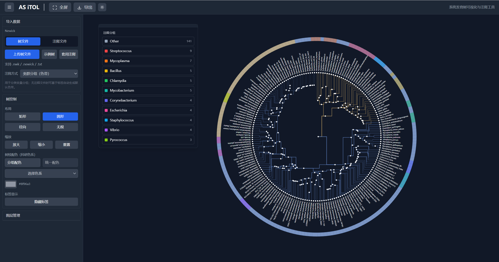

# AS ITOL - 系统发育树可视化与注释工具

> ⚠️ **警告：项目处于实验阶段**
> 本项目目前仍处于实验开发阶段，功能可能不稳定，**不可用于生产环境**。请仅用于测试和研究目的。

AS ITOL (Advanced Systematics Interactive Tree Of Life) 是一款功能强大的系统发育树可视化与注释工具，专为生物信息学研究人员设计，提供直观、灵活的树结构展示和多维度数据注释功能。

## 功能特性

### 🎨 多种布局方式
- **矩形布局**：传统树状结构，根节点位于左侧，分支向右延伸
- **圆形布局**：根节点位于中心，分支沿圆周分布
- **径向布局**：根节点位于中心，分支沿径向向外延伸
- **无根布局**：不指定根节点位置，树结构自由分布

### 📸 系统预览



### 📊 注释系统
- **色带注释** (COLORSTRIP)：为节点添加分类信息和颜色标记
- **热图注释** (HEATMAP)：展示基因表达等数值矩阵数据
- **条形图注释** (BARCHART)：比较不同节点的数值数据
- **饼图注释** (PIECHART)：展示节点数据的比例关系
- **二进制注释** (BINARY)：展示节点的二元特征
- **条带注释** (STRIP)：为节点添加自定义条带
- **序列比对注释** (ALIGNMENT)：展示基因序列比对结果
- **连接注释** (CONNECTIONS)：展示节点之间的关联关系
- **弹出框注释** (POPUP)：为节点添加详细的弹出信息

### 🎯 交互功能
- **缩放与平移**：支持鼠标拖拽平移和滚轮缩放
- **节点选择**：点击节点进行选择和高亮
- **标签显示控制**：可开关节点标签显示
- **树枝颜色调整**：支持单色和基于分支的颜色方案
- **布局切换**：实时切换不同的树布局方式

### 📁 文件处理
- **支持 Newick 格式**：导入标准系统发育树文件
- **注释文件导入**：支持多种格式的注释数据导入
- **示例数据**：内置丰富的示例树和注释数据

### 🔧 配置选项
- **节点大小调整**：自定义节点显示大小
- **树枝宽度调整**：自定义树枝显示宽度
- **背景颜色设置**：适应不同的显示环境
- **标签字体大小**：根据需要调整标签大小

## 快速开始

### 安装

1. **克隆项目**
   ```bash
   git clone https://github.com/XiaoshengSu/asitol.git
   cd as-itol
   ```

2. **安装依赖**
   ```bash
   # 前端依赖
   cd frontend
   yarn install

   ```

3. **启动开发服务器**
   ```bash
   # 启动前端开发服务器
   cd frontend
   yarn dev

   ```

### 使用指南

1. **加载树数据**
   - 点击左侧面板中的「上传文件」按钮，选择 Newick 格式的树文件
   - 或点击「加载示例」按钮，使用内置的示例数据

2. **添加注释**
   - 点击左侧面板中的「注释文件」选项卡
   - 选择注释类型并上传相应的注释文件
   - 或使用示例数据中的默认注释

3. **调整布局**
   - 在「控制」面板中选择不同的布局方式（矩形、圆形、径向、无根）
   - 调整缩放级别和节点大小

4. **自定义样式**
   - 在「控制」面板中调整树枝颜色、宽度等样式选项
   - 切换标签显示状态

5. **导出结果**
   - 使用顶部导航栏中的「导出」功能，选择所需的导出格式

## 示例数据

系统内置了丰富的示例数据，包括：

- **灵长类进化树**：展示人类、黑猩猩、大猩猩等灵长类动物的进化关系
- **哺乳动物分类树**：包含多种哺乳动物的分类信息
- **物种分类注释**：为示例树提供对应的分类学注释

## 技术架构

- **前端**：Svelte + TypeScript + D3.js
- **后端**：Go + Gin + GORM
- **数据存储**：SQLite (本地) / PostgreSQL (生产)
- **渲染引擎**：SVG + Canvas 双模式

## 浏览器兼容性

- Chrome 90+
- Firefox 88+
- Safari 14+
- Edge 90+

## 贡献指南

我们欢迎社区贡献！如果您有任何建议或改进，请：

1. Fork 本仓库
2. 创建您的特性分支 (`git checkout -b feature/amazing-feature`)
3. 提交您的更改 (`git commit -m 'Add some amazing feature'`)
4. 推送到分支 (`git push origin feature/amazing-feature`)
5. 开启一个 Pull Request

## 许可证

本项目采用 MIT 许可证 - 详情请参阅 [LICENSE](LICENSE) 文件

## 联系方式

- 项目主页：https://github.com/yourusername/as-itol
- 问题反馈：https://github.com/yourusername/as-itol/issues

## 🚀 未来计划

### 账号系统
- 用户注册和登录功能
- 个人资料管理
- 权限控制和角色管理

### 项目管理
- 项目创建和保存
- 版本控制和历史记录
- 团队协作和共享功能

### 后端集成
- 树数据和注释的持久化存储
- 大型数据集的处理和分析
- API接口开发，支持第三方集成

### 树注释功能
- 更多类型的注释图层支持
- 注释数据的动态更新和编辑
- 注释与树结构的联动交互

### 样式定制
- 树枝样式的精细调整（虚线、点线、粗细渐变等）
- 节点样式的自定义（形状、大小、颜色、边框等）
- 标签样式的高级配置（字体、位置、旋转、背景等）

### 树枝样式
- 基于分支长度的动态样式
- 基于进化距离的颜色渐变
- 自定义分支样式的保存和应用

---

**AS ITOL** - 让系统发育树可视化变得简单直观！