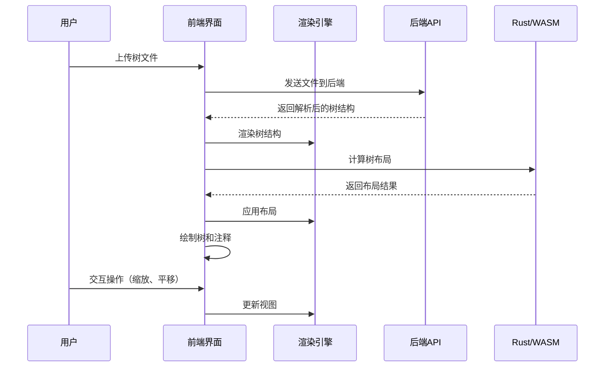
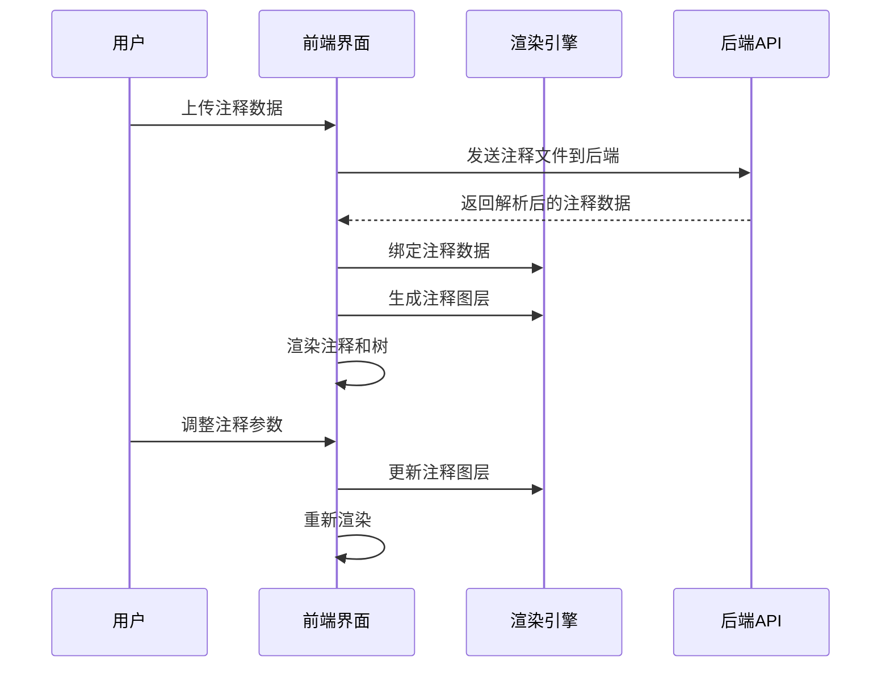

# itol 系统发育树可视化与注释工具前端开发文档

## 1. 项目概述

itol（Interactive Tree Of Life）是一款专为生物信息学领域设计的系统发育树可视化与注释工具，旨在为科研人员提供直观、高效的系统发育树分析与展示能力。本前端开发文档详细规划项目的前端技术架构、模块划分、开发流程和实施计划，专注于实现即开即用、用完即走的核心功能，强调组件化设计和轻量化实现。

### 1.1 核心目标
- 实现系统发育树的可视化渲染
- 提供丰富的注释图层系统，支持多维度数据可视化
- 构建高性能渲染引擎，支持大规模树的流畅交互
- 开发用户友好的界面，提供直观的交互体验
- 实现即开即用、用完即走的轻量级工具
- 强调组件化设计，确保代码可维护性和可扩展性

### 1.2 技术栈选择

#### 1.2.1 前端技术栈
- **框架**：SvelteKit + TypeScript 5.0
- **状态管理**：Svelte的reactive和stores
- **UI组件**：Tailwind CSS + 自研可视化组件
- **样式**：Tailwind CSS 3.3.0
- **图表库**：
  - D3.js 7.8.0（核心可视化库）
  - Canvas API（大规模树渲染）
  - WebGPU（超大规模树和复杂注释渲染）
- **布局计算**：Rust/WASM + WebGPU（高性能布局算法）
- **网络请求**：Fetch API + 自定义封装
- **构建工具**：Vite 4.4.0

### 1.3 项目结构

#### 1.3.1 前端结构（组件化设计）
```
frontend/
├── public/                   # 静态资源
├── src/
│   ├── assets/               # 资源文件
│   ├── components/           # 通用组件（组件化）
│   │   ├── tree/             # 树可视化组件
│   │   │   ├── TreeCanvas.svelte   # Canvas渲染组件
│   │   │   ├── TreeSvg.svelte      # SVG渲染组件
│   │   │   ├── TreeLayout.svelte   # 布局算法组件
│   │   │   └── TreeControls.svelte # 树控制组件
│   │   ├── annotation/       # 注释组件
│   │   │   ├── ColorStrip.svelte   # 色带注释组件
│   │   │   ├── Heatmap.svelte      # 热图注释组件
│   │   │   ├── BarChart.svelte     # 条形图注释组件
│   │   │   ├── PieChart.svelte     # 饼图注释组件
│   │   │   └── LayerManager.svelte # 图层管理组件
│   │   └── ui/               # UI组件
│   │       ├── FileUpload.svelte   # 文件上传组件
│   │       ├── ExportDialog.svelte # 导出对话框组件
│   │       └── SettingsPanel.svelte # 设置面板组件
│   ├── routes/                # 路由配置
│   │   ├── +page.svelte       # 主页面
│   │   └── editor/            # 编辑器页面
│   │       └── +page.svelte   # 编辑器视图
│   ├── services/             # API服务
│   │   ├── api.ts            # API请求封装
│   │   └── treeService.ts    # 树相关服务
│   ├── utils/                # 工具函数
│   │   ├── layout.ts         # 布局算法工具
│   │   ├── parser.ts         # 数据解析工具
│   │   └── renderer.ts       # 渲染工具
│   ├── stores/               # 状态管理
│   │   ├── treeStore.ts      # 树状态管理
│   │   ├── annotationStore.ts # 注释状态管理
│   │   └── uiStore.ts        # 界面状态管理
│   ├── types/                # TypeScript类型定义
│   │   ├── tree.ts           # 树相关类型
│   │   ├── annotation.ts     # 注释相关类型
│   │   └── layout.ts         # 布局相关类型
│   ├── lib/                  # 通用库
│   │   ├── webgpu/           # WebGPU相关代码
│   │   └── wasm/             # WASM相关代码
│   ├── app.svelte            # 应用入口组件
│   └── app.d.ts              # 类型声明文件
├── vite.config.ts            # Vite配置
├── tsconfig.json             # TypeScript配置
├── package.json              # 包依赖
└── tailwind.config.js        # Tailwind配置
```

## 2. 技术架构设计

### 2.1 架构风格
- **前端**：采用组件化架构，结合Vue 3的组合式API，实现高内聚低耦合的代码结构
- **整体**：前后端分离，通过API进行数据交互，实现即开即用的轻量级应用

### 2.2 核心流程图

#### 2.2.1 树可视化流程


#### 2.2.2 注释处理流程


## 3. 核心功能模块开发计划

### 3.1 渲染引擎模块
- **功能**：实现树的可视化渲染
- **实现要点**：
  - SVG + Canvas 双模式渲染
  - 多布局算法实现
  - 图层管理和合成
  - 自适应缩放和导航
- **开发步骤**：
  1. 设计渲染引擎架构
  2. 实现基础渲染组件（TreeCanvas.vue、TreeSvg.vue）
  3. 开发布局算法（TreeLayout.vue）
  4. 实现图层管理（LayerManager.vue）
  5. 优化渲染性能

### 3.2 注释图层模块
- **功能**：实现多种注释图层的渲染
- **实现要点**：
  - 支持9种注释图层类型
  - 数据绑定和映射
  - 图层参数配置
  - 交互和事件处理
- **开发步骤**：
  1. 设计注释图层接口
  2. 实现基础图层类型（ColorStrip.vue、Heatmap.vue等）
  3. 开发数据映射逻辑
  4. 实现图层配置UI（LayerManager.vue）
  5. 编写图层测试

### 3.3 交互系统模块
- **功能**：实现用户与树的交互
- **实现要点**：
  - 导航和缩放
  - 节点选择和操作
  - 搜索和过滤
  - 状态管理
- **开发步骤**：
  1. 设计交互事件系统
  2. 实现基本导航功能（TreeControls.vue）
  3. 开发选择和操作功能
  4. 实现搜索和过滤
  5. 优化交互体验

### 3.4 数据导入/导出模块
- **功能**：处理数据的导入和导出
- **实现要点**：
  - 多格式文件上传
  - 数据验证和预览
  - 多格式文件导出
  - 会话保存和恢复（浏览器本地存储）
- **开发步骤**：
  1. 设计文件上传组件（FileUpload.vue）
  2. 实现数据验证逻辑
  3. 开发导出功能（ExportDialog.vue）
  4. 实现会话管理
  5. 测试导入/导出流程

## 4. 技术实现细节

### 4.1 渲染引擎

#### 4.1.1 双模式渲染
- **SVG渲染**：
  - 用于中小规模树（< 10,000节点）和需要高精度的场景
  - 支持矢量缩放，保持图形清晰度
  - 适合交互式操作，如节点选择、悬停效果
  - 实现：使用D3.js的SVG API，创建可交互的树结构

- **Canvas渲染**：
  - 用于大规模树（≥ 10,000节点），提高渲染性能
  - 适合静态展示和快速缩放
  - 实现：使用HTML5 Canvas API，批量绘制树结构

- **自动切换**：
  - 根据树大小和复杂度自动选择渲染模式
  - 提供手动切换选项，满足不同场景需求

#### 4.1.2 布局算法
- **圆形布局**：
  - 使用极坐标计算节点位置
  - 根节点位于中心，叶节点均匀分布在圆周上
  - 适合展示大型对称的树结构

- **矩形布局**：
  - 使用笛卡尔坐标计算节点位置
  - 根节点位于顶部，分支向下延伸
  - 适合展示层级关系明确的树结构

- **径向布局**：
  - 结合极坐标和笛卡尔坐标
  - 根节点位于中心，分支沿径向向外延伸
  - 适合展示具有明显进化距离差异的树结构

- **无根树布局**：
  - 使用力导向算法计算节点位置
  - 不指定根节点位置，树结构自由分布
  - 适合展示未确定根位置的系统发育树

#### 4.1.3 Rust/WASM优化
- **核心布局计算**：
  - 使用Rust实现高性能布局算法
  - 编译为WebAssembly，提高计算性能
  - 处理大规模树的布局计算
  - 实现：使用wasm-bindgen和wasm-pack构建WASM模块

### 4.2 注释图层系统

#### 4.2.1 图层管理器
- **功能**：
  - 图层堆栈管理：添加、删除、重排序图层
  - 图层渲染协调：控制不同图层的渲染顺序
  - 事件分发：处理图层间的事件传递
  - 实现：使用Vue的响应式系统管理图层状态

#### 4.2.2 图层类型实现
- **COLORSTRIP**：
  - 实现环形和矩形色带
  - 映射分类变量到颜色
  - 支持自定义颜色方案

- **HEATMAP**：
  - 实现网格单元格和色阶映射
  - 映射数值矩阵到颜色
  - 支持自定义色阶范围

- **BARCHART**：
  - 实现极坐标和直角坐标柱形图
  - 映射数值到柱高
  - 支持多数据系列

- **PIECHART**：
  - 实现堆叠扇环
  - 映射比例数据到扇形角度
  - 支持多层数据展示

- **其他图层类型**：
  - BINARY：实现存在/不存在标记
  - STRIP：实现线性序列条带
  - ALIGNMENT：实现序列比对可视化
  - CONNECTIONS：实现节点间连线
  - POPUP：实现交互浮层

### 4.3 状态管理

#### 4.3.1 轻量级状态管理
- **使用Vue 3的响应式API**：
  - `reactive`：创建响应式对象
  - `ref`：创建响应式引用
  - `computed`：创建计算属性
  - 避免使用复杂的状态管理库，保持轻量化

- **状态组织**：
  - 树状态：存储当前树结构和配置
  - 注释状态：存储注释数据和图层配置
  - 界面状态：存储界面配置和交互状态

#### 4.3.2 状态持久化
- **localStorage存储**：
  - 存储临时状态，如用户配置、会话信息
  - 实现会话保存和恢复
  - 限制存储大小，避免浏览器存储限制

### 4.4 性能优化

#### 4.4.1 前端优化
- **虚拟滚动**：
  - 处理长列表和大数据集
  - 仅渲染可视区域内的元素

- **防抖和节流**：
  - 优化频繁操作，如缩放、拖拽
  - 减少不必要的计算和渲染

- **懒加载**：
  - 按需加载组件和数据
  - 减小初始加载体积

- **代码分割**：
  - 使用Vite的代码分割功能
  - 按需加载模块，提高首屏加载速度

#### 4.4.2 渲染优化
- **视图裁剪**：
  - 仅渲染视口内的内容
  - 减少不必要的绘制操作

- **层级缓存**：
  - 缓存静态图层
  - 避免重复计算和渲染

- **增量渲染**：
  - 仅更新变化的部分
  - 提高交互响应速度

- **Web Worker**：
  - 将耗时计算移至后台线程
  - 避免阻塞主线程，保持UI响应流畅

## 5. 前端UI设计

### 5.1 整体布局
- **顶部工具栏**：
  - 品牌标识
  - 主要功能按钮：上传树、上传注释、导出
  - 布局选择器：圆形、矩形、径向、无根树

- **主内容区**：
  - 树可视化画布（占据主要空间）
  - 侧边工具栏：缩放控制、选择工具、搜索框

- **右侧边栏**：
  - 图层管理：添加、删除、配置图层
  - 注释配置：调整注释参数
  - 属性面板：编辑节点和分支属性

### 5.2 核心页面

#### 5.2.1 编辑器页面
- **功能**：
  - 树可视化主画布
  - 工具栏：布局选择、缩放控制、选择工具
  - 图层面板：添加、删除、配置图层
  - 属性面板：节点和分支属性编辑

- **布局**：
  - 顶部：工具栏
  - 中央：树可视化画布
  - 右侧：图层和属性面板

- **实现**：
  - 使用Vue 3的组合式API构建组件
  - 响应式设计，适配不同屏幕尺寸
  - 模块化布局，便于维护和扩展

### 5.3 交互设计

#### 5.3.1 树交互
- **导航**：
  - 鼠标滚轮：缩放树视图
  - 鼠标拖拽：平移画布
  - 双击节点：聚焦到该节点
  - 键盘箭头：平移画布

- **选择**：
  - 单击节点：选择单个节点
  - 拖拽框选：选择多个节点
  - Ctrl+单击：多选节点
  - Shift+单击：范围选择节点

- **操作**：
  - 右键菜单：显示节点操作选项
  - 键盘快捷键：常用操作的快捷方式
  - 悬停效果：显示节点详细信息

#### 5.3.2 注释交互
- **图层管理**：
  - 拖拽排序：调整图层顺序
  - 复选框：显示/隐藏图层
  - 齿轮图标：配置图层参数
  - 垃圾桶图标：删除图层

- **数据绑定**：
  - 拖放文件：上传注释数据
  - 映射向导：指导数据绑定过程
  - 预览面板：查看绑定结果

#### 5.3.3 导出交互
- **格式选择**：
  - 下拉菜单：选择导出格式
  - 配置对话框：设置导出参数
  - 预览：导出前预览效果

- **导出选项**：
  - 图片格式：SVG、PDF、PNG、JPEG
  - 数据格式：Newick、CSV、JSON
  - 交互格式：HTML

## 6. API服务

### 6.1 API接口

#### 6.1.1 树API
- **解析树**：
  - URL：`POST /api/trees/parse`
  - 请求体：`multipart/form-data`，包含树文件
  - 响应：`{"id": "tree_1", "name": "Tree Name", "format": "newick", "node_count": 100, "structure": {...}}`

- **计算布局**：
  - URL：`POST /api/trees/layout`
  - 请求体：`{"tree": {...}, "type": "circular", "config": {...}}`
  - 响应：`{"id": "layout_1", "type": "circular", "data": {...}}`

#### 6.1.2 注释API
- **解析注释**：
  - URL：`POST /api/annotations/parse`
  - 请求体：`multipart/form-data`，包含注释文件和树ID
  - 响应：`{"id": "annotation_1", "name": "Annotation Name", "type": "colorstrip", "data": {...}}`

### 6.2 API服务实现
- **Axios配置**：
  - 设置基础URL、超时时间
  - 配置请求/响应拦截器
  - 处理错误和异常情况

- **服务封装**：
  - 创建树服务、注释服务等模块化服务
  - 提供Promise-based API，便于异步操作
  - 实现请求缓存，减少重复请求

## 7. 开发流程与管理

### 7.1 开发阶段

#### 阶段1：核心功能开发（3-4周）
- 实现基础渲染组件（TreeCanvas.vue、TreeSvg.vue）
- 开发布局算法（TreeLayout.vue）
- 实现基本交互功能（TreeControls.vue）
- 目标：完成MVP核心功能

#### 阶段2：功能完善（4-6周）
- 实现注释图层组件（ColorStrip.vue、Heatmap.vue等）
- 开发高级交互功能（选择、搜索、过滤）
- 实现导入/导出功能（FileUpload.vue、ExportDialog.vue）
- 目标：完成所有核心功能

#### 阶段3：性能优化（2-3周）
- 优化渲染性能（双模式渲染、视图裁剪）
- 提高交互响应速度（防抖、节流、Web Worker）
- 优化加载性能（代码分割、懒加载）
- 目标：支持大规模树的流畅处理

#### 阶段4：测试与部署（1-2周）
- 单元测试：测试核心功能组件
- 集成测试：测试完整流程
- 性能测试：测试大规模数据处理能力
- 部署：构建生产版本，部署到静态网站托管服务

### 7.2 代码规范

#### 7.2.1 Vue代码规范
- **文件命名**：
  - 组件文件：使用PascalCase命名（如TreeCanvas.vue）
  - 工具文件：使用camelCase命名（如layout.ts）
  - 类型文件：使用PascalCase命名（如Tree.ts）

- **代码风格**：
  - 遵循Vue 3官方风格指南
  - 使用TypeScript确保类型安全
  - 组件命名：使用PascalCase命名组件
  - 变量命名：使用camelCase命名变量和函数
  - 常量命名：使用UPPER_SNAKE_CASE命名常量

- **注释规范**：
  - 组件注释：为每个组件添加清晰的注释
  - 函数注释：为复杂函数添加参数和返回值说明
  - 类型注释：为TypeScript类型添加描述

#### 7.2.2 架构规范
- **组件化**：
  - 拆分可复用组件
  - 组件职责单一，易于测试和维护
  - 组件接口清晰，便于组合和扩展

- **状态管理**：
  - 使用轻量级状态管理
  - 状态逻辑与UI逻辑分离
  - 避免过度使用全局状态

- **路由设计**：
  - 简洁的路由结构
  - 懒加载路由，提高首屏加载速度
  - 路由参数类型安全

- **响应式设计**：
  - 适配不同屏幕尺寸
  - 移动端友好的交互设计
  - 可访问性考虑，支持键盘导航

### 7.3 测试策略

#### 7.3.1 单元测试
- **组件测试**：
  - 测试树渲染组件（TreeCanvas.vue、TreeSvg.vue）
  - 测试注释图层组件（ColorStrip.vue、Heatmap.vue等）
  - 测试UI组件（FileUpload.vue、ExportDialog.vue等）

- **工具函数测试**：
  - 测试布局算法（layout.ts）
  - 测试数据解析（parser.ts）
  - 测试渲染工具（renderer.ts）

- **钩子测试**：
  - 测试自定义钩子（useTree.ts、useAnnotation.ts等）

#### 7.3.2 集成测试
- **页面集成**：
  - 测试完整页面流程（EditorView.vue）
  - 测试组件交互和状态传递
  - 测试路由导航

- **API集成**：
  - 测试前端与后端API交互
  - 测试数据加载和错误处理
  - 测试请求缓存和重试机制

#### 7.3.3 性能测试
- **渲染性能**：
  - 测试不同大小树的渲染时间
  - 测试缩放和导航性能
  - 测试注释图层渲染性能

- **交互性能**：
  - 测试用户交互响应时间
  - 测试大型操作的性能
  - 测试复杂布局的性能

- **加载性能**：
  - 测试首屏加载时间
  - 测试资源加载性能
  - 测试代码分割效果

## 8. 部署与运维

### 8.1 部署架构

#### 8.1.1 开发环境
- **本地开发服务器**：
  - 运行命令：`npm run dev`
  - 热重载：支持实时代码更新
  - 开发模式：启用详细错误信息和调试工具

#### 8.1.2 生产环境
- **构建生产版本**：
  - 运行命令：`npm run build`
  - 优化：代码压缩、资源优化、tree shaking
  - 输出：生成dist目录，包含优化后的静态文件

- **部署平台**：
  - 静态文件服务器：Nginx
  - CDN：使用CDN加速静态资源
  - 托管服务：GitHub Pages、Netlify、Vercel等

### 8.2 配置管理

#### 8.2.1 环境变量
- **开发环境**：`.env.development`
  - 配置开发API地址、调试模式等

- **生产环境**：`.env.production`
  - 配置生产API地址、优化选项等

#### 8.2.2 构建配置
- **Vite配置**：
  - 配置构建选项（outputDir、assetsDir等）
  - 配置代理（开发环境API请求转发）
  - 配置插件（TypeScript、Tailwind CSS等）

## 9. 结论

本前端开发文档详细规划了itol系统发育树可视化与注释工具的前端技术架构、模块划分、开发流程和实施计划，专注于实现即开即用、用完即走的核心功能，强调组件化设计和轻量化实现。

通过分阶段开发策略，我们将实现一个功能强大、性能优异的前端应用，满足生物信息学研究的复杂需求。文档中详细的技术实现细节和开发计划，为前端项目的顺利实施提供了坚实的基础。

未来，我们将根据实际开发过程中的反馈和需求，不断优化和完善前端应用，确保itol工具能够成为生物信息学研究领域的重要辅助工具，为科研人员提供直观、高效的系统发育树分析与展示能力。