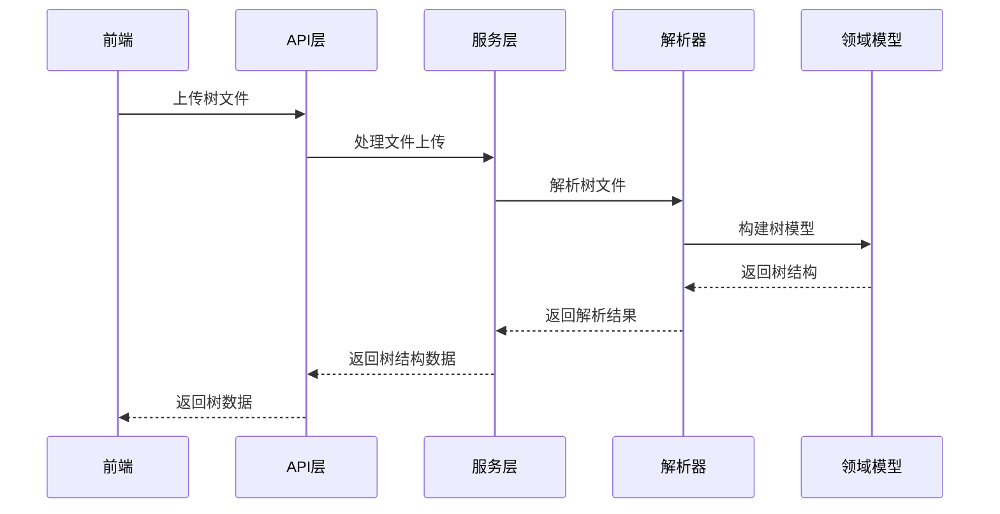
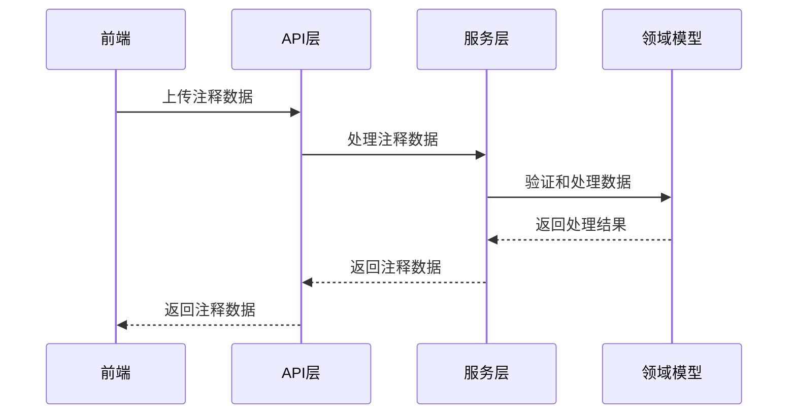

# itol 系统发育树可视化与注释工具后端开发文档

## 1. 项目概述

itol（Interactive Tree Of Life）是一款专为生物信息学领域设计的系统发育树可视化与注释工具，旨在为科研人员提供直观、高效的系统发育树分析与展示能力。本后端开发文档详细规划项目的后端技术架构、模块划分、开发流程和实施计划，专注于实现即开即用、用完即走的核心功能，强调模块化设计和轻量化实现。

### 1.1 核心目标
- 实现多格式系统发育树解析
- 提供标准化API接口，支持前端数据交互
- 构建高性能解析引擎，支持大规模树的处理
- 实现轻量化设计，确保快速启动和响应
- 强调模块化设计，确保代码可维护性和可扩展性

### 1.2 技术栈选择

#### 1.2.1 后端技术栈（轻量化）
- **语言**：Golang 1.20
- **Web框架**：Gin 1.9.0 + Echo（轻量级、高性能）
- **生物信息学库**：自研解析器（Go） + 解析器生成器：处理树格式解析
- **依赖管理**：Go Modules

### 1.3 项目结构

#### 1.3.1 后端结构（模块化设计）
```
backend/
├── cmd/
│   └── server/
│       └── main.go           # 应用入口
├── internal/
│   ├── api/                  # API层（模块化）
│   │   ├── handlers/         # 请求处理器
│   │   │   ├── tree_handler.go     # 树相关请求处理
│   │   │   └── annotation_handler.go # 注释相关请求处理
│   │   ├── middleware/       # 中间件
│   │   │   ├── cors.go        # CORS中间件
│   │   │   └── logger.go      # 日志中间件
│   │   └── routes/           # 路由定义
│   │       └── router.go      # 路由注册
│   ├── service/              # 业务逻辑层（模块化）
│   │   ├── tree/             # 树处理服务
│   │   │   ├── tree_service.go      # 树服务实现
│   │   │   └── annotation_service.go # 注释服务实现
│   ├── domain/               # 领域模型层（模块化）
│   │   └── models/           # 数据模型
│   │       ├── tree.go        # 树模型
│   │       ├── node.go        # 节点模型
│   │       └── annotation.go  # 注释模型
│   ├── infrastructure/       # 基础设施层（模块化）
│   │   ├── parser/           # 树解析器
│   │   │   ├── newick_parser.go    # Newick格式解析
│   │   │   ├── nexus_parser.go     # Nexus格式解析
│   │   │   ├── phyloxml_parser.go  # PhyloXML格式解析
│   │   │   ├── parser.go           # 解析器接口
│   │   │   └── generator/           # 解析器生成器
│   └── pkg/                  # 通用包（模块化）
│       └── utils/            # 工具函数
│           ├── file.go        # 文件处理工具
│           ├── response.go    # 响应处理工具
│           └── parallel.go    # 并行处理工具
├── go.mod                    # Go模块定义
└── .env.example              # 环境变量示例
```

## 2. 技术架构设计

### 2.1 架构风格
- **后端**：采用模块化架构，专注于核心的树解析和API接口
- **整体**：前后端分离，通过API进行数据交互，实现即开即用的轻量级应用

### 2.2 核心流程图

#### 2.2.1 树解析流程


#### 2.2.2 注释处理流程


## 3. 核心功能模块开发计划

### 3.1 树解析模块
- **功能**：解析多种格式的系统发育树文件
- **实现要点**：
  - 支持 Newick、Nexus、PhyloXML、NHX 格式
  - 实现递归下降解析器
  - 提取树结构和元数据
  - 构建节点索引系统
- **开发步骤**：
  1. 设计树数据模型（tree.go、node.go）
  2. 实现解析器接口（parser.go）
  3. 开发Newick格式解析器（newick_parser.go）
  4. 开发Nexus格式解析器（nexus_parser.go）
  5. 开发PhyloXML格式解析器（phyloxml_parser.go）
  6. 实现节点索引
  7. 编写单元测试

### 3.2 API接口模块
- **功能**：提供RESTful API接口，处理前端请求
- **实现要点**：
  - RESTful路由设计
  - 请求参数验证
  - 响应格式统一
  - 错误处理机制
- **开发步骤**：
  1. 设计API路由（router.go）
  2. 实现树相关请求处理（tree_handler.go）
  3. 实现注释相关请求处理（annotation_handler.go）
  4. 开发中间件（cors.go、logger.go）
  5. 编写API文档
  6. 进行API测试

### 3.3 服务层模块
- **功能**：实现核心业务逻辑
- **实现要点**：
  - 树处理服务：解析、布局计算
  - 注释处理服务：验证、处理
  - 轻量化设计：内存存储，无持久化
- **开发步骤**：
  1. 实现树服务（tree_service.go）
  2. 实现注释服务（annotation_service.go）
  3. 开发业务逻辑
  4. 编写服务层测试

## 4. 技术实现细节

### 4.1 树解析器

#### 4.1.1 Newick解析
- **格式特点**：
  - 使用括号表示树结构：`(A,B,(C,D)E)F`
  - 支持分支长度：`(A:0.1,B:0.2,(C:0.3,D:0.4)E:0.5)F:0.6`
  - 支持节点标签：`(A:0.1[label="Species A"],B:0.2)Root:0.3`
  - 支持NHX扩展标签：`(A:0.1[&&NHX:name=A:taxid=123],B:0.2)Root:0.3`

- **实现**：
  - 递归下降解析器：处理括号嵌套结构
  - 状态机：处理标签和分支长度解析
  - 错误处理：提供详细的解析错误信息
  - 性能优化：使用缓冲区减少内存分配

#### 4.1.2 Nexus解析
- **格式特点**：
  - 分块结构：`#NEXUS`, `BEGIN TAXA;`, `BEGIN TREES;`等
  - 支持多树定义：`TREE tree1 = ((A,B),C); TREE tree2 = ((A,C),B);`
  - 支持字符矩阵：`BEGIN CHARACTERS;`块中定义序列数据
  - 注释支持：`[comment]`格式的注释

- **实现**：
  - 块解析器：处理不同类型的块
  - 多树支持：解析和存储多棵树
  - 字符矩阵解析：处理序列数据
  - 错误恢复：从解析错误中恢复，继续处理其他块

#### 4.1.3 PhyloXML解析
- **格式特点**：
  - XML格式：使用标签表示树结构
  - 丰富的元数据：支持节点和分支的详细注释
  - 序列关联：支持关联序列数据
  - 复杂结构：支持嵌套的注释和元数据

- **实现**：
  - XML解析器：使用Go标准库的xml包
  - 结构映射：将XML元素映射到Go结构体
  - 元数据提取：保留完整的元数据信息
  - 错误处理：处理XML格式错误和验证

### 4.2 节点索引系统

#### 4.2.1 数据结构
- **树节点结构体**：
  - ID：唯一标识符
  - Label：节点标签
  - BranchLength：分支长度
  - Parent：父节点引用
  - Children：子节点列表
  - Metadata：元数据映射

- **树结构体**：
  - Root：根节点
  - Nodes：节点映射（ID -> 节点）
  - LeafCount：叶节点数量
  - NodeCount：总节点数量
  - Format：树格式

#### 4.2.2 索引优化
- **哈希表**：
  - 存储节点ID到节点对象的映射
  - 实现O(1)时间复杂度的节点查找

- **双向链表**：
  - 存储父子关系
  - 便于遍历树结构

- **预计算**：
  - 节点深度：从根节点到该节点的路径长度
  - 路径：从根节点到该节点的节点ID序列
  - 子树大小：该节点的子节点数量

### 4.3 API设计

#### 4.3.1 树API
- **解析树**：
  - URL：`POST /api/trees/parse`
  - 方法：POST
  - 请求体：`multipart/form-data`，包含树文件
  - 响应：`{"id": "tree_1", "name": "Tree Name", "format": "newick", "node_count": 100, "structure": {...}}`

- **计算布局**：
  - URL：`POST /api/trees/layout`
  - 方法：POST
  - 请求体：`{"tree": {...}, "type": "circular", "config": {...}}`
  - 响应：`{"id": "layout_1", "type": "circular", "data": {...}}`

#### 4.3.2 注释API
- **解析注释**：
  - URL：`POST /api/annotations/parse`
  - 方法：POST
  - 请求体：`multipart/form-data`，包含注释文件和树ID
  - 响应：`{"id": "annotation_1", "name": "Annotation Name", "type": "colorstrip", "data": {...}}`

### 4.4 服务层实现

#### 4.4.1 树服务
- **功能**：
  - 处理树文件上传和解析
  - 计算树布局
  - 提供树结构数据

- **实现**：
  - 文件处理：临时存储和读取上传文件
  - 解析调用：根据文件格式选择合适的解析器
  - 布局计算：实现基本的布局算法
  - 内存管理：使用内存存储，避免持久化

#### 4.4.2 注释服务
- **功能**：
  - 处理注释文件上传和解析
  - 验证注释数据
  - 提供注释数据

- **实现**：
  - 文件处理：临时存储和读取上传文件
  - 数据验证：验证注释数据格式和完整性
  - 数据处理：转换和标准化注释数据
  - 内存管理：使用内存存储，避免持久化

### 4.5 性能优化

#### 4.5.1 解析性能优化
- **内存分配**：
  - 使用对象池：减少频繁的内存分配和GC
  - 缓冲区重用：重用解析缓冲区，减少内存碎片

- **解析算法**：
  - 递归优化：避免深度递归，防止栈溢出
  - 并行处理：大型树的解析可以并行处理子树

- **I/O优化**：
  - 流式读取：大文件使用流式读取，避免一次性加载到内存
  - 临时文件：使用临时文件存储大文件，减少内存使用

#### 4.5.2 API性能优化
- **请求处理**：
  - 连接复用：使用HTTP/2或连接池

- **响应处理**：
  - 压缩：使用gzip压缩响应数据
  - 流式响应：大响应使用流式发送

- **并发处理**：
  - 工作池：使用工作池处理并发请求
  - 非阻塞IO：使用非阻塞IO处理文件上传

## 5. 开发流程与管理

### 5.1 开发阶段

#### 阶段1：核心功能开发（2-3周）
- 实现树数据模型（tree.go、node.go）
- 开发解析器接口和基础实现（parser.go）
- 实现API路由和请求处理（router.go、tree_handler.go）
- 目标：完成MVP核心功能

#### 阶段2：功能完善（3-4周）
- 开发Newick、Nexus、PhyloXML格式解析器
- 实现注释服务和请求处理（annotation_service.go、annotation_handler.go）
- 完善API接口和错误处理
- 目标：完成所有核心功能

#### 阶段3：性能优化（1-2周）
- 优化解析性能（内存分配、I/O优化）
- 提高API响应速度（并发处理）
- 测试大规模树的处理能力
- 目标：支持大规模树的流畅处理

#### 阶段4：测试与部署（1周）
- 单元测试：测试核心功能模块
- 集成测试：测试完整流程
- 性能测试：测试大规模数据处理能力
- 部署：编译为可执行文件，部署到服务器

### 5.2 代码规范

#### 5.2.1 Go代码规范
- **文件命名**：
  - 包文件：使用snake_case命名（如tree_handler.go）
  - 测试文件：使用`_test.go`后缀（如tree_handler_test.go）

- **代码风格**：
  - 遵循Go官方代码规范
  - 使用gofmt和golint保持代码风格一致
  - 变量命名：使用camelCase命名变量和函数
  - 常量命名：使用UPPER_SNAKE_CASE命名常量
  - 类型命名：使用PascalCase命名类型

- **注释规范**：
  - 包注释：为每个包添加清晰的注释
  - 函数注释：为每个函数添加参数和返回值说明
  - 类型注释：为结构体和接口添加描述
  - 代码注释：为复杂逻辑添加说明

#### 5.2.2 架构规范
- **模块化**：
  - 功能模块化，低耦合高内聚
  - 每个模块职责单一，易于测试和维护
  - 模块接口清晰，便于扩展

- **依赖管理**：
  - 使用Go Modules管理依赖
  - 最小化依赖，减少外部库使用
  - 依赖版本锁定，确保构建可重现

- **错误处理**：
  - 使用标准的错误处理模式
  - 错误信息清晰，包含上下文
  - 避免panic，使用错误返回

- **测试规范**：
  - 单元测试覆盖率目标：≥ 80%
  - 集成测试：测试完整流程
  - 性能测试：测试大规模数据处理能力

## 6. 测试策略

### 6.1 单元测试

#### 6.1.1 解析器测试
- **Newick解析测试**：
  - 测试标准Newick格式解析
  - 测试带分支长度的Newick格式解析
  - 测试带标签的Newick格式解析
  - 测试NHX扩展标签解析
  - 测试错误处理（格式错误、语法错误）

- **Nexus解析测试**：
  - 测试基本Nexus格式解析
  - 测试多树解析
  - 测试字符矩阵解析
  - 测试错误处理（格式错误、语法错误）

- **PhyloXML解析测试**：
  - 测试基本PhyloXML格式解析
  - 测试元数据解析
  - 测试序列关联解析
  - 测试错误处理（格式错误、语法错误）

#### 6.1.2 服务层测试
- **树服务测试**：
  - 测试树文件上传和解析
  - 测试布局计算
  - 测试错误处理

- **注释服务测试**：
  - 测试注释文件上传和解析
  - 测试数据验证和处理
  - 测试错误处理

#### 6.1.3 API层测试
- **路由测试**：
  - 测试路由注册和匹配
  - 测试中间件功能

- **请求处理测试**：
  - 测试正常请求处理
  - 测试错误请求处理
  - 测试边界情况

### 6.2 集成测试

#### 6.2.1 完整流程测试
- **树解析流程**：
  - 上传树文件 → 解析 → 返回树结构
  - 测试不同格式的树文件
  - 测试不同大小的树文件

- **注释处理流程**：
  - 上传注释文件 → 解析 → 返回注释数据
  - 测试不同类型的注释数据

#### 6.2.2 性能测试
- **解析性能**：
  - 测试不同大小树的解析时间
  - 测试内存使用情况
  - 测试CPU使用情况

- **API性能**：
  - 测试API响应时间
  - 测试并发请求处理能力
  - 测试大文件上传处理能力

### 6.3 基准测试
- **解析器基准测试**：
  - 测试不同格式解析器的性能
  - 测试不同大小树的解析性能

- **服务层基准测试**：
  - 测试服务层处理性能
  - 测试布局计算性能

- **API层基准测试**：
  - 测试API请求处理性能
  - 测试响应生成性能

## 7. 部署与运维

### 7.1 部署架构

#### 7.1.1 开发环境
- **本地运行**：
  - 运行命令：`go run cmd/server/main.go`
  - 开发模式：启用详细日志和调试信息

#### 7.1.2 生产环境
- **编译**：
  - 编译命令：`go build -o itol-server cmd/server/main.go`
  - 优化：启用编译器优化，减少可执行文件大小

- **部署**：
  - 部署到云服务器或VPS
  - 可选择使用systemd或supervisor管理进程
  - 配置环境变量和启动参数

### 7.2 配置管理

#### 7.2.1 环境变量
- **开发环境**：`.env.development`
  - 配置开发模式、日志级别等

- **生产环境**：`.env.production`
  - 配置生产模式、端口、主机等

#### 7.2.2 配置项
- **服务器配置**：
  - `PORT`：服务器端口
  - `HOST`：服务器主机
  - `ENVIRONMENT`：运行环境（development/production）

- **安全配置**：
  - `CORS_ORIGINS`：允许的跨域来源
  - `MAX_UPLOAD_SIZE`：最大上传文件大小

- **性能配置**：
  - `WORKER_POOL_SIZE`：工作池大小
  - `REQUEST_TIMEOUT`：请求超时时间

### 7.3 监控与日志

#### 7.3.1 监控
- **系统监控**：
  - CPU、内存使用率
  - 网络流量
  - 服务可用性

- **应用监控**：
  - API响应时间
  - 错误率
  - 处理请求数
  - 解析性能

#### 7.3.2 日志
- **开发环境**：
  - 控制台日志：详细的调试信息
  - 文件日志：完整的请求和响应日志

- **生产环境**：
  - 错误日志：捕获和记录错误
  - 访问日志：记录API请求和响应
  - 性能日志：记录关键操作的性能指标

## 8. 结论

本后端开发文档详细规划了itol系统发育树可视化与注释工具的后端技术架构、模块划分、开发流程和实施计划，专注于实现即开即用、用完即走的核心功能，强调模块化设计和轻量化实现。

通过分阶段开发策略，我们将实现一个功能强大、性能优异的后端服务，满足生物信息学研究的复杂需求。文档中详细的技术实现细节和开发计划，为后端项目的顺利实施提供了坚实的基础。

未来，我们将根据实际开发过程中的反馈和需求，不断优化和完善后端服务，确保itol工具能够成为生物信息学研究领域的重要辅助工具，为科研人员提供直观、高效的系统发育树分析与展示能力。